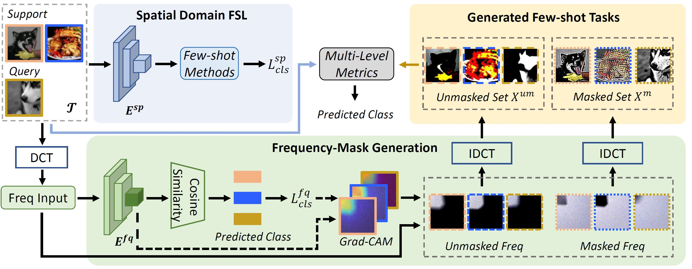

# Frequency Guidance Matters in Few-shot Learning

The code repository for "Frequency Guidance Matters in Few-shot Learning" [[paper]](https://openaccess.thecvf.com/content/ICCV2023/papers/Cheng_Frequency_Guidance_Matters_in_Few-Shot_Learning_ICCV_2023_paper.pdf) (Accepted by ICCV 2023) in PyTorch. If you use any content of this repo for your work, please cite the following bib entry:

    @inproceedings{cheng2023frequency,
    title={Frequency guidance matters in few-shot learning},
    author={Cheng, Hao and Yang, Siyuan and Zhou, Joey Tianyi and Guo, Lanqing and Wen, Bihan},
    booktitle={Proceedings of the IEEE/CVF International Conference on Computer Vision},
    pages={11814--11824},
    year={2023}
    }

## Overall Framework




## Prerequisites

The following packages are required to run the scripts:

- [PyTorch-2.0.0 and torchvision](https://pytorch.org)

- Package [tensorboardX](https://github.com/lanpa/tensorboardX)

- Dataset: please download the dataset and put images (split) into the folder ''data/[name of the dataset]/images (split)''

- Pre-trained weights: please download the [pre-trained weights](https://drive.google.com/drive/folders/1WvhbwWX_rhSc3SjPO1CYmqicqvTGrF4D?usp=sharing) of the encoder if needed.

## Dataset

Please download the following dataset to "./data/[name of the dataset]" folder and change the data path in the 'dataloader' folder before running the code.

### MiniImageNet Dataset

The MiniImageNet dataset is a subset of the ImageNet that includes a total number of 100 classes and 600 examples per class. We follow the [previous setup](https://github.com/twitter/meta-learning-lstm), and use 64 classes as SEEN categories, 16 and 20 as two sets of UNSEEN categories for model validation and evaluation, respectively.

### CUB Dataset
[Caltech-UCSD Birds (CUB) 200-2011 dataset](http://www.vision.caltech.edu/visipedia/CUB-200-2011.html) is initially designed for fine-grained classification. It contains in total 11,788 images of birds over 200 species. On CUB, we randomly sampled 100 species as SEEN classes, and another two 50 species are used as two UNSEEN sets. We crop all images with given bounding boxes before training. Data Split is available on GoogleDrive [here](https://drive.google.com/file/d/1fXflwCYcr9VXu66eMASb9eUy2EHBP58g/view?usp=sharing).


### TieredImageNet Dataset
[TieredImageNet](https://github.com/renmengye/few-shot-ssl-public) is a large-scale dataset  with more categories, which contains 351, 97, and 160 categories for model training, validation, and evaluation, respectively. The dataset can also be downloaded from [here](https://github.com/kjunelee/MetaOptNet).

### FS-DomainNet Dataset

FS-DomainNet is reorganized from [DomainNet dataset](http://ai.bu.edu/M3SDA/#dataset) with only 299 sub-classes with more than 20 samples (minimum requirements for 5-shot setting with 15 query samples) in each domain (Sketch, Quickdraw, Real, Painting, Clipart, Infograph), and use 191, 47, and 61 for model training, validation and evaluation, respectively. 

Data Split is available on BaiduYun [here](https://pan.baidu.com/s/1AL3EcAbUXDsEu4VQ2_AIWA) with the extra code "vrfx", and GoogleDrive [here](https://drive.google.com/file/d/1H3PsLXR6sJK6dKTIOpP3qznsypAQ4Ix6/view?usp=sharing). You can find the split file of each domain in "./data/domainnet/split".


The dataset directory should look like this:
```bash
├── data
    ├── mini-imagenet
        ├── split
            ├── train.csv
            ├── test.csv
            ├── val.csv
        ├── images
    ├── tiered-imagenet
        ├── test_images.npz
        ├── test_labels.pkl   
        ├── train_images.npz  
        ├── train_labels.pkl
        ├── val_images.npz
        ├── val_labels.pkl
    ├── cub
        ├── split
            ├── train.csv
            ├── test.csv
            ├── val.csv
        ├── images
    ├── cubraw
        ├── split
            ├── train.csv
            ├── test.csv
            ├── val.csv       
        ├── images
    ├── domainnet
        ├── split
            ├── xxx_train.txt
            ├── xxx_test.txt
            ├── xxx_val.txt
            ... xxx={clipart, infograph, painting, quickdraw, real, sketch}
        ├── images
            ├── sketch
            ├── quickdraw
            ├── real
            ├── painting
            ├── clipart
            ├── infograph
```

## Model Training and Evaluation
Please use **train_fsl.py** and follow the instructions below.


## Training scripts for FGFL (Here we take FEAT as base few-shot method)

For example, to train the 1-shot/5-shot 5-way FGFL with FEAT model with ResNet-12 backbone on MiniImageNet:

    $ python train_fsl.py --model_class GAIN_Feat --shot 1 --lr 0.0002 --step_size 20 --eval_shot 1 --init_weights2 ./saves/mini_proto_freq/1-shot.pth --use_euclidean --init_weights ./saves/mini_feat/feat-1-shot.pth --tag 1s

    $ python train_fsl.py --model_class GAIN_Feat --shot 5 --lr 0.00005 --step_size 10 --eval_shot 5 --init_weights2 ./saves/mini_proto_freq/5-shot.pth --use_euclidean --init_weights ./saves/mini_feat/feat-5-shot.pth --max_epoch 200 --lr_mul 1 --temperature2 32 --balance 0.01 --tag 5s

To train the 1-shot/5-shot 5-way FGFL with FEAT model with ResNet-12 backbone on TieredImageNet:

    $ python train_fsl.py --model_class GAIN_Feat --shot 1 --lr 0.0001 --step_size 10 --eval_shot 1 --init_weights2 ./saves/tiered_proto_freq/tiered-pre.pth --use_euclidean --init_weights ./saves/tiered_feat/feat-1-shot.pth --dataset TieredImageNet --balance 0.01 --tag 1s

    $ python train_fsl.py --model_class GAIN_Feat --shot 5 --lr 0.0001 --step_size 20 --eval_shot 5 --init_weights2 ./saves/tiered_proto_freq/tiered-pre.pth --use_euclidean --init_weights ./saves/tiered_feat/feat-5-shot.pth --dataset TieredImageNet --balance 0.1 --temperature2 32 --tag 5s


## Acknowledgment

Our code builds upon the following code publicly available, and we thank the following repos for providing helpful components/functions in our work.

- [ProtoNet](https://github.com/cyvius96/prototypical-network-pytorch)

- [MatchingNet](https://github.com/gitabcworld/MatchingNetworks)

- [FRN](https://github.com/Tsingularity/FRN)

- [FEAT](https://github.com/Sha-Lab/FEAT)

- [DeepEMD](https://github.com/icoz69/DeepEMD)

- [DFR](https://github.com/chenghao-ch94/DFRFS)
